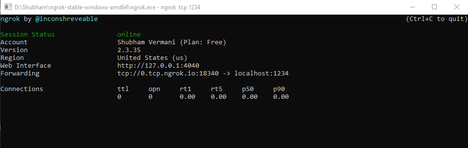

# Python_Chatroom
This is Python chatroom using socket programming and kivy. It is a minor project for 3rd semester, as well as my first group project. It is loosely based on Sentdex's [socket programming tutorial](https://pythonprogramming.net/sockets-tutorial-python-3/) and [kivy tutorial](https://pythonprogramming.net/introduction-kivy-application-python-tutorial/).<br /><br />
Unfortunately, right now it has three server files (because I don't have too much knowledge of multithreading in python), so each have to be run separately on the server PC.

## Installation

### Windows

1. Clone the project on your local machine by typing the following command in git bash (or download the file yourself). You can choose to delete the `socket-server.py`, `server-send-df.py` and `server-recv-df.py` files if someone else is running the server **(Only one user needs to be constantly running the server files)**
```
git clone https://github.com/light7714/Python_Chatroom.git
```

2. The person running the server files needs to use ngrok to make tcp tunnels for the server files. Go to https://ngrok.com/ and download ngrok. After extracting the file, run 3 separate instances of the ngrok CMD. Type in each instance *respectively* (keep the instances running for the whole duration of the chat application running on any computer)
```
ngrok tcp 1234 
```
```
ngrok tcp 1235 --region eu
```
```
ngrok tcp 1236 --region ap
```
Note the tunnel address and port number.<br />
For example:



In the above example, in the front of `Forwarding`:<br />
`0.tcp.ngrok.io` is the tunnel IP address, and `18340` is the port number

3. Open the `socket_client.py` file in a text editor. Replace the variable `ip1` and `port` with the first tunnel address and port. Similarly `ip2`, `ALT_PORT`, and `ip3`,`ALT_PORT_2`. Save the changes made.

4. Install [python](https://www.python.org/) for windows if you don't have it (preferably python 3.8). Activate a virtual environment in Powershell/CMD by either installing virtualenv and following its instructions to make a virtual environment, or by using the venv package which comes with python by default
```
py -m venv env
```
This will make a folder named env.
Then type (Powershell)
```
path_where_env_is_stored\env\Scripts\Activate.ps1
```
(CMD)
```
path_where_env_is_stored\env\Scripts\activate
```

5. To install all the dependencies, run
```
pip install -r requirements.txt
```

6. To run the server files, open 3 instances of Powershell/CMD with virtual environment activated, navigate to downloaded directory, then run the below 3 commands in the instances respectively
```
python socket-server.py
```
```
python server-send-df.py
```
```
python server-recv-df.py
```

7. To run the client files, open a Powershell/CMD window with virtual environment activated, then type
```
python test_client.py
```
